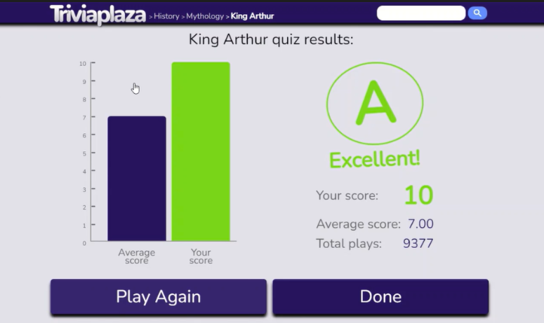

# OpenAI Triviaplaza robot

This robot solves a [Triviaplaza quiz](https://www.triviaplaza.com/king-arthur-quiz/) using OpenAI.

The robot takes a trivia quiz about King Arthur from Triviaplaza.com. The robot reads the question and the answer options and uses the API interface to ask the OpenAI artificial intelligence which of the options it thinks is the right answer, which the robot chooses.

> Note: By changing the address in ${url} variable in the *** Variables *** section, you can configure the robot to perform another quiz..

The robot uses the [RPA.Browser.Playwright](https://robocorp.com/docs/libraries/rpa-framework/rpa-browser-playwright) library for browser automation and custom keyword library for interacting with OpenAI API.

https://user-images.githubusercontent.com/84192057/220574818-bb99d51e-2f1b-43f5-af33-eb417d0fac26.mp4

## Learning materials

- [Robocorp Developer Training Courses](https://robocorp.com/docs/courses)
- [Documentation links on Robot Framework](https://robocorp.com/docs/languages-and-frameworks/robot-framework)
- [Example bots in Robocorp Portal](https://robocorp.com/portal)
